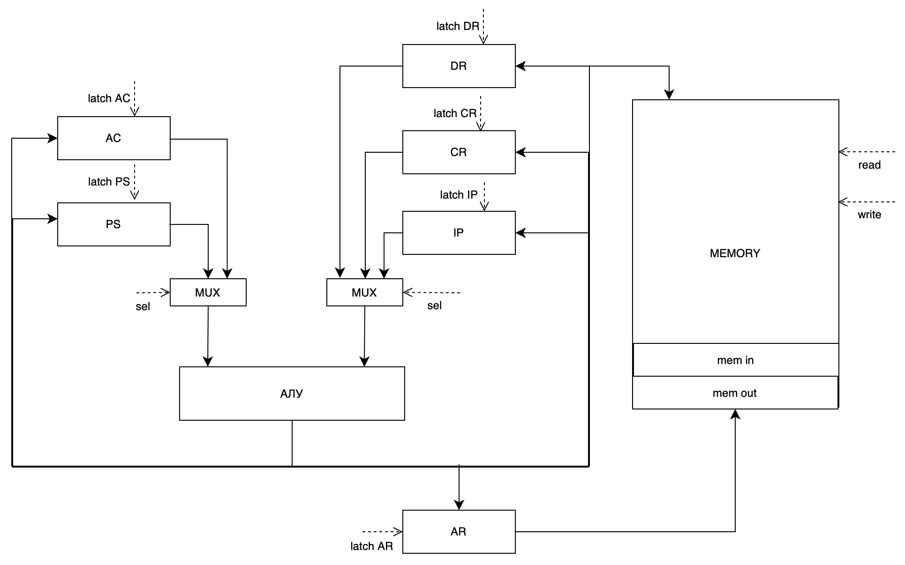
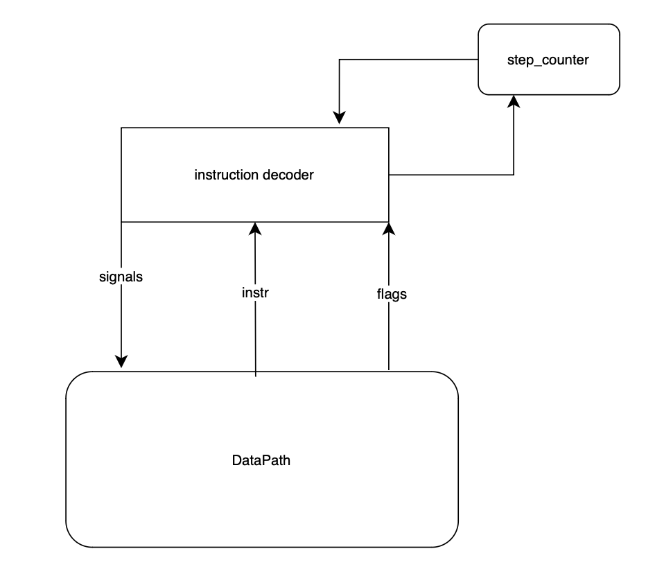

# MyAsm. Транслятор и модель

- P3214, Боринский Игорь Дмитриевич.
- `asm | acc | neum | hw | instr | struct | trap -> stream | mem | pstr | prob2 | cache`
- С упрощением

## Язык программирования

### Синтаксис

**Форма Бэкуса-Наура:**

```ebnf
<программа> ::= <строка_программы> | <строка_программы> <программа>
<строка_программы> ::= <адрес> | [<метка>] <адресная команда> <операнд> | 
[<метка>] <безадресная команда> | [<метка>] <метка константы> <константа> | <пустая строка> 

<метка> ::= <слово>
<адресная команда> = add | load | store | ... | sub | jmp | (см. систему команд)
<безадресная команда> ::= cla | di | ei | ... | hlt
<операнд> ::= <число> | <метка>
<константа> ::= <число> | <число> '<слово>'
<слово> ::= <символ> | <слово> <символ>
<число> ::= <цифра> | <число> <цифра>
<цифра> ::= 0| 1 | 2 | .. | 8 | 9
<символ> ::= a | b | c | ... | z | A | B | C | ... | Z | <цифра>
```

**Пояснение:**

Каждая непустая строка программы это одно из нижеперечисленных:

* **адресная команда**
    * может иметь метку в начале
    * указывается название команды и адрес операнда через пробел
* **безадресная команда**
    * может иметь метку в начале
    * указывается только название команды
* **константа**
    * может иметь метку в начале
    * указывается метка константы `word:` и константа
    * константа может быть 16-битным знаковым числом
    * константа может быть строкой: указывается длина строки и строка через пробел
* **адрес**
    * указывается специальное слово `org` и адрес в десятичном формате

Пример программы, вычисляющей С = A + B

```asm
org 5
A: word: 10
B: word: 15
C: word: 0

start: cla
load A
add B
store C
hlt
```

**Семантика**

- Видимость данных -- глобальная
- Поддерживаются целочисленные литералы, находящиеся в диапазоне от $`-2^{31}`$ до $`2^{31}-1`$
- Поддерживаются строковые литералы, символы стоки необходимо заключить в кавычки, перед строкой через запятую необходимо указать длину
- Код выполняется последовательно

- Программа обязательно должна включать метку `start:`, указывающую на 1-ю выполняемую интсрукцию. Эта метка не может
  указывать на константу.
- Название метки не должно совпадать с названием команды и не может начинаться с цифры.
- Метки находятся на одной строке с командами, операнды находятся на одной строке с командами.
- Пустые строки игнорируются, количество пробелов в начале и конце строки не важно.
- Любой текст, расположенный в конце строки после символа `';'` трактуется как комментарий.

Память выделяется статически, при запуске модели.

## Организация памяти

* Память команд и данныx --- общая
* Размер машинного слова --- `32` бит
* Память содержит `2^11` ячеек
* Ячейка с адресом `0` зарезервирована под вектор прерывания устройства ввода
* Адрес `2045` является указателем стека при старте процессора. Стек растет вверх.
* Ячейка с адресом `2046` маппится на устройство ввода
* Ячейка с адресом `2047` маппится на устройство вывода


* Поддерживаются следующие **виды адресаций**:
    * **Прямая**: в качестве аргумента команды передается адрес ячейки, значение в которой будет использовано как
      операнд.
      Например, если `mem[30] = 25`, то команда `add 30` обозначает, что к значению в аккумуляторе добавится число 25.

    * **Косвенная**: в качестве аргумента команды передается адрес, по которому лежит адрес операнда.
      Например, если `mem[30] = 25`, `mem[33] = 30`, то команда `add (33)` также обозначает, что к аккумулятору
      добавится значение 25.


* Существует несколько **регистров**:
    * Аккумулятор (AC): в него записываются результаты всех операций
    * Счетчик команд (IP): хранит адрес следующей выполняемой команды
    * Регистр состояния (PS): хранит флаги состояния

      ```
        | N | Z | C |
          2   1   0
      ```
        * 0-й бит хранит значение флага C
        * 1-й бит хранит значение флага Z
        * 2-й бит хранит значение флага N


* Регистр данных (DR): хранит данные для записи в память и считывания из памяти
* Регистр адреса (AR): хранит адрес последней ячейки в памяти, к которой было обращение

## Система команд

Особенности процессора:

- Машинное слово -- `32` бита, знаковое.
- В качестве аргументов команды принимают `11` битные беззнаковые адреса

Каждая команда выполняется в несколько циклов:

1. Цикл выборки команды: по адресу из счетчика команд из памяти достается команда

- `IP -> AR, IP + 1 -> IP, mem[AR] -> DR, DR -> CR`

2. Цикл выборки операнда (для адресных команд): в регистр данных помещается адрес операнда, регистр данных передавется в
   регистр адреса, из памяти в регистр данных записывается значение операнда

- `CR[addr] -> DR, DR -> AR, mem[AR] -> DR`

3. Цикл исполнения: совершаются действия, необходимые для выполнения команды. Результаты вычисления записываются в
   аккумулятор


### Набор инструкций

| Язык  | Адресная | Ветвление | Количество тактов<br/>(без выборки адреса) | Описание                                                                                       |
|:------|:---------|-----------|:-------------------------------------------|:-----------------------------------------------------------------------------------------------|
| load  | +        | -         | 3                                          | загрузить значение из заданной ячейки                                                          |
| store | +        | -         | 3                                          | загрузить значение в заданную ячейку                                                           |
| add   | +        | -         | 3                                          | добавить значение из заданной ячейки к аккумулятору                                            |
| sub   | +        | -         | 3                                          | вычесть значение из заданной ячейки из аккумулятора                                            |
| jmp   | +        | +         | 3                                          | перейти в заданную ячейку                                                                      |
| cmp   | +        | -         | 3                                          | выставить флаги как результат вычитания заданной ячейки из аккумулятора, сохранить аккумулятор |
| jmn   | +        | +         | 3                                          | перейти в заданную ячейку если N = 1                                                           |
| jmnn  | +        | +         | 3                                          | перейти в заданную ячейку если N = 0                                                           |
| jmc   | +        | +         | 3                                          | перейти в заданную ячейку если C = 1                                                           |
| jmnc  | +        | +         | 3                                          | перейти в заданную ячейку если C = 0                                                           |
| jmz   | +        | +         | 3                                          | перейти в заданную ячейку если Z = 1                                                           |
| jmnz  | +        | +         | 3                                          | перейти в заданную ячейку если Z = 0                                                           |
| asl   | -        | -         | 2                                          | сдвинуть значение в аккумуляторе влево, AC[15] -> C                                            |
| asr   | -        | -         | 2                                          | сдвинуть значение в аккумуляторе вправо, AC[0] -> C                                            |
| dec   | -        | -         | 2                                          | уменьшить значение в аккумуляторе на 1                                                         |
| inc   | -        | -         | 2                                          | увеличить значение в аккумуляторе на 1                                                         |
| cla   | -        | -         | 2                                          | очистить аккумулятор (записать в него 0)                                                       |
| hlt   | -        | -         | 2                                          | остановить работу программы                                                                    | |
| nop   | -        | -         | 1                                          | отсутствие операции                                                                            |


### Кодирование инструкций

- Машинный код сереализуется в список JSON.
- Один элемент списка, одна инструкция или константа.

Пример сереализованной команды `load (1)` и константы 20:

```json
[
  {
    "index": 10,
    "opcode": "load",
    "operand": 1,
    "value": 0,
    "address": True
  },
  {
    "index": 2,
    "value": 20,
    "opcode" : "nop"
  }
]
```

где:

- `index` -- адрес объекта в памяти;
- `opcode` -- код оператора, идентификатор команды; У констант для упрощения всегда "nop"
- `operand` -- аргумент команды, адрес ячейки над которой совершается операция. Отсуствует у безадресных команд и
  констант;
- `address` -- логическое поле, имеющее значение True, если адресация косвенная, и False, если прямая.
- `value` -- значение ячейке с адресом index, если она будет интерпретирована как данные. Так как команды сериализуются
  в высокоуровневую структуру, было принято решение установить у команд это значение в 0.

## Транслятор

Интерфейс командной строки: `translator.py <input_file> <target_file>`

Реализовано в модуле: [translator](./translator.py)

Этапы трансляции (функция `translate`):

1. Выделение меток из кода, проверка их корректности (не совпадают с названиями команд, отсуствуют дубликаты)
2. Парсинг кода построчно, определение типа команды (адресная, безадресная, константа)
3. Генерация машинного кода в зависимости от типа команды

Правила генерации машинного кода:

- Метки не сохраняются в машинном коде. Метки, использованные в качестве операнда, преобразуются к адресам команд

## Модель процессора

Интерфейс командной строки: `maсhine.py <machine_code_file> <input_file>`

Реализовано в модуле: [maсhine](./machine.py).

### DataPath

Реализован в классе `DataPath`.




`data_memory` -- однопортовая память, поэтому либо читаем, либо пишем.
`registers`
Сигналы (реализованы в виде методов класса):
В

- `set_reg` -- защёлкнуть выбранное значение в регистре с указанным именем
- `rd` --- считать данные из `mem[AR]` в регистр `DR`
- `wr` --- записать данные из регистра `DR` в `mem[AR]`

В виде отдельного класса реализовано арифметико-логическое устройство (АЛУ)

- в данном классе реализован метод `calc`, принимающий аргументы с одного или двух входов и совершающий над ними
  арифметико-логическую операцию
- в результате выполнения операций устанавливаются следующие флаги
    - `Z` -- значение в аккумуляторе равно 0
    - `N` -- значение в аккумуляторе отрицательно
    - `C` -- произошло переполнение (перенос из 16-го бита)

### ControlUnit

Реализован в классе `ControlUnit`.



- Метод `decode_and_execute_instruction` моделирует выполнение полного цикла инструкции (цикл выборки инструкции,
  операнда, исполнения)
- В рамках реализованной модели на python существуют счетчик количества инструкций только для наложения ограничения на
  кол-во шагов моделирования

Особенности работы модели:

- Цикл симуляции осуществляется в функции `simulation`.
- Шаг моделирования соответствует одной инструкции процессора с выводом состояния в журнал.
- Для журнала состояний процессора используется стандартный модуль `logging`.
- Количество инструкций для моделирования лимитировано.
- Остановка моделирования осуществляется при:
    - превышении лимита количества выполняемых инструкций;
    - если выполнена инструкция `hlt`.


## Тестирование
Тестирование выполняется при помощи golden test-ов.

Реализованные програмы

1. [hello world](examples/myasm/hello.myasm): вывести на экран строку `'Hello World!'`
2. [cat](examples/myasm/cat.myasm): программа `cat`, повторяем ввод на выводе.
3. [hello_username](examples/myasm/hello_username.myasm) -- программа `hello_username`: запросить у пользователя его
   имя, считать его, вывести на экран приветствие
4. [prob2](examples/myasm/prob2.myasm): найти сумму всех четных чисел Фибоначчи, не превышающих `4 000 000`.

Golden test'ы реализованы тут [golden_test](./golden_test.py):

CI при помощи Github Action:

``` yaml
name: Run Tests

on:
  push:
    branches:
      - main
  pull_request:
    branches:
      - main

jobs:
  test:
    runs-on: ubuntu-latest

    steps:
      - name: Checkout repository
        uses: actions/checkout@v2

      - name: Set up Python
        uses: actions/setup-python@v2
        with:
          python-version: 3.11

      - name: Install dependencies
        run: |
          python -m pip install --upgrade pip
          pip install poetry
          poetry install
          pip install pytest pytest-golden

      - name: Run golden tests
        run: pytest golden_test.py
```

где:

- `poetry` -- управления зависимостями для языка программирования Python.
- `pytest` -- утилита для запуска тестов.


- Значения всех регистров, кроме PS и CR выводятся в десятичном формате
- Значение регистра `PS` выводится в двоичном формате для удобного определения флагов, наличия запроса прерываний и тд.
- В качестве значения регистра `CR`выводятся код оператора и операнд (при наличии)
- Если в какой-то регистр записан символ, в листинге выводится его код

Также в лог выводятся события вида `INPUT symbol` и `OUTPUT symbol`


```text
| ФИО                        | алг              | LoC | code байт | code инстр. | инстр. | такт. | вариант |
| Боринский Игорь Дмитриевич | hello            | 22  | -         | 29          | 121    | 365   | asm | acc | neum | hw | instr | struct | stream | mem | pstr | prob2     |
| Боринский Игорь Дмитриевич | cat              | 21  | -         | 16          | 32     | 104   | asm | acc | neum | hw | instr | struct | stream | mem | pstr | prob2     |
| Боринский Игорь Дмитриевич | hello_username   | 111 | -         | 117         | 409    | 1225  | asm | acc | neum | hw | instr | struct | stream | mem | pstr | prob2     |
| Боринский Игорь Дмитриевич | prob2            | 28  | -         | 25          | 370    | 1072  | asm | acc | neum | hw | instr | struct | stream | mem | pstr | prob2     |


```
